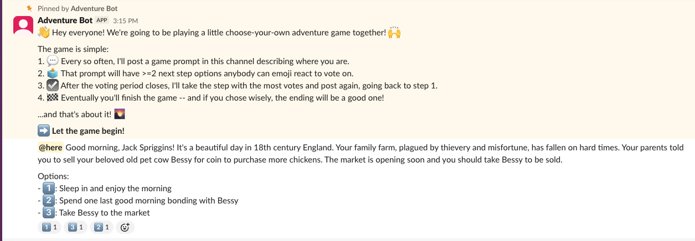

<h1 align="center">Temporal Adventure Bot Workflow</h1>

<p align="center">A Vercel Workflow port of the choose-your-own-adventure Slack bot.</p>

<p align="center">
	<!-- prettier-ignore-start -->
	<!-- ALL-CONTRIBUTORS-BADGE:START - Do not remove or modify this section -->
	<a href="#contributors" target="_blank"></a>
<!-- ALL-CONTRIBUTORS-BADGE:END -->
	<!-- prettier-ignore-end -->
	<a href="https://github.com/JoshuaKGoldberg/temporal-adventure-bot-workflow/blob/main/.github/CODE_OF_CONDUCT.md" target="_blank"></a>
	<a href="https://codecov.io/gh/JoshuaKGoldberg/temporal-adventure-bot-workflow" target="_blank"></a>
	<a href="https://github.com/JoshuaKGoldberg/temporal-adventure-bot-workflow/blob/main/LICENSE.md" target="_blank"></a>
	
</p>

<p align="center">
	
</p>

## Usage

A [Vercel Workflow](https://useworkflow.dev) port of [temporal-adventure-bot](https://github.com/JoshuaKGoldberg/temporal-adventure-bot).
The game logic is the same; durable execution comes from the Workflow DevKit instead of a Temporal server, so there's no worker process to keep alive.

Create a `.env` with a [Slack app](https://api.slack.com/apps)'s credentials:

```shell
SLACK_BOT_TOKEN=xoxb-...
SLACK_CHANNEL=C0123456789
SLACK_SIGNING_SECRET=...
```

`SLACK_CHANNEL` must be the channel _ID_, not its name.
Invite the bot to that channel with `/invite @Your Bot Name`: `chat:write.public` covers posting, but adding reactions, reading them, and pinning all require membership.

Then:

```shell
pnpm dev
```

Point two Slack slash commands at the running server:

| Command  | Route    | What it does                                              |
| -------- | -------- | --------------------------------------------------------- |
| `/begin` | `/start` | Posts the instructions and opens the first poll           |
| `/force` | `/force` | Forces a choice: `random`, or `1` through the last option |

Both routes verify Slack's request signature before doing anything.

### How It Works

`runGame` is one long-lived durable workflow that loops over game entries.
For each entry it posts a poll, then races two outcomes:

- `sleep()` for `settings.interval`, after which it counts reactions and looks for consensus
- a hook keyed on the channel, which `/force` resumes to override the vote

Every Slack call lives in a `"use step"` function, so the workflow itself stays deterministic and replayable.

## Development

See [`.github/CONTRIBUTING.md`](./.github/CONTRIBUTING.md), then [`.github/DEVELOPMENT.md`](./.github/DEVELOPMENT.md).
Thanks! ✨

## Contributors

<!-- spellchecker: disable -->
<!-- ALL-CONTRIBUTORS-LIST:START - Do not remove or modify this section -->
<!-- prettier-ignore-start -->
<!-- markdownlint-disable -->
<table>
  <tbody>
    <tr>
      <td align="center"><a href="http://www.joshuakgoldberg.com"><br /><sub><b>Josh Goldberg ✨</b></sub></a><br /><a href="https://github.com/JoshuaKGoldberg/temporal-adventure-bot-workflow/commits?author=JoshuaKGoldberg" title="Code">💻</a> <a href="#content-JoshuaKGoldberg" title="Content">🖋</a> <a href="https://github.com/JoshuaKGoldberg/temporal-adventure-bot-workflow/commits?author=JoshuaKGoldberg" title="Documentation">📖</a> <a href="#ideas-JoshuaKGoldberg" title="Ideas, Planning, & Feedback">🤔</a> <a href="#infra-JoshuaKGoldberg" title="Infrastructure (Hosting, Build-Tools, etc)">🚇</a> <a href="#maintenance-JoshuaKGoldberg" title="Maintenance">🚧</a> <a href="#projectManagement-JoshuaKGoldberg" title="Project Management">📆</a> <a href="#tool-JoshuaKGoldberg" title="Tools">🔧</a></td>
    </tr>
  </tbody>
</table>

<!-- markdownlint-restore -->
<!-- prettier-ignore-end -->

<!-- ALL-CONTRIBUTORS-LIST:END -->
<!-- spellchecker: enable -->

> 💝 This package was templated with [`create-typescript-app`](https://github.com/JoshuaKGoldberg/create-typescript-app) using the [Bingo framework](https://create.bingo).
